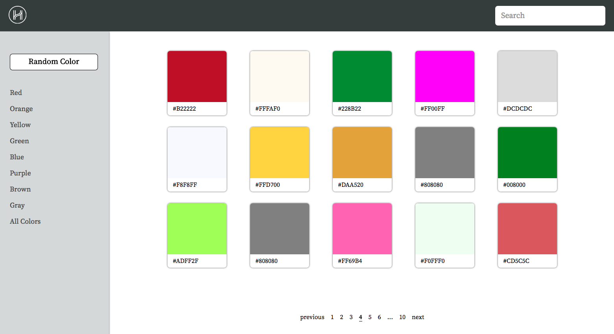
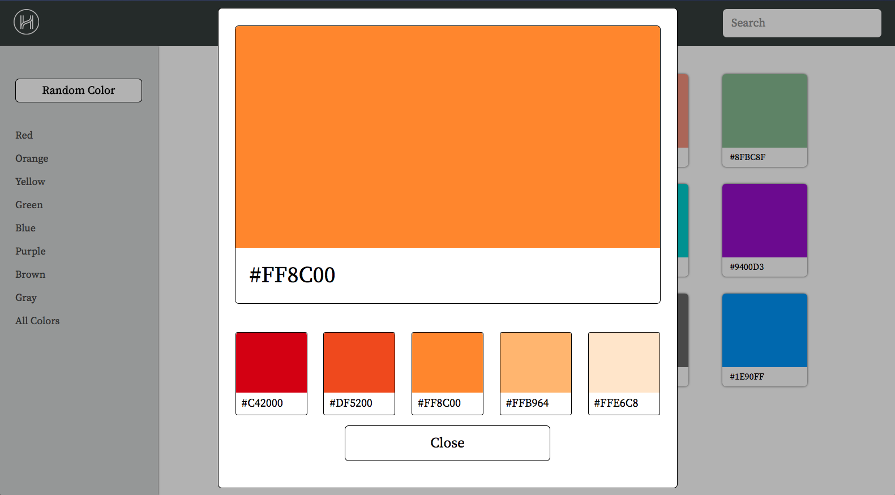

# Pretty Color Picker 5000

URL: [Live-link](https://pretty-colors-hh.herokuapp.com/#/)



Pretty Color Picker 5000 is a web application built on the MERN (MongoDB, Express.js, React.js, MongoDB) stack that allows developers, designer, and aliens to quickly find that perfect color from a database of over 150 colors plus thousands of shades.

## Contents
**Features**

* Search by name of a color
* Detail view of selected color with various shades of the selected color
* Displays hex values of each color
* Dynamically renders the correct number of color swatches that can fit on the screen and the corresponding number of pages
* Responsive design
* Node backend and Mongo database full of colors

## Search


Upon loading, the landing page queries the database to retrieve all colors which it stores in a redux slice of state. This allows the application to implement searches on the client thus reducing server load. These searches are then stored in their own redux slice of state. An example search can be seen above. 

## Detail color view



A click on any color will render a modal displaying the color in more detail. This includes four different shadings of the color with the corresponding hex values. 

## Dynamically renders number of color swatches and includes a responsive design


The number of swatches to display and the corresponding page numbers are calculated by using JavaScript to get the demensions of the screen. Then using the following equation

    return Math.floor(width / 225) * Math.floor(height / 215);


the correct number swatches to display can be calculated. By add an event listener and taking advantage of Reacts lifecycle methods the page numbers and number of swatches can be made to recalculate everytime the size of the page changes.

## Backend

Node.js was used for the backend because of the fact that an app can be spun up very quick while keeping the unnecessary baggage to a minimum. Modulazation was used to make the code more maintainable and readable by splitting the [routes](./app/api/routes/colorsRoutes.js), [controllers](./app/api/controllers/colorsController.js), [models](./app/api/models/colorsModel.js), and the [server](./app/server.js) into their own files. A mongo database is used to store all the colors as key value pairs shown below.

```
{
    "_id": {
        "$oid": "59c164466422616c44e6d956"
    },
    "name": "aliceblue",
    "value": "#f0f8ff",
    "Created_date": {
        "$date": "2017-09-19T18:39:02.055Z"
    },
    "__v": 0
}
```

The frontend communicates with the backend via ajax request stored in the [util file](./frontend/util/colors_api_util.js).

